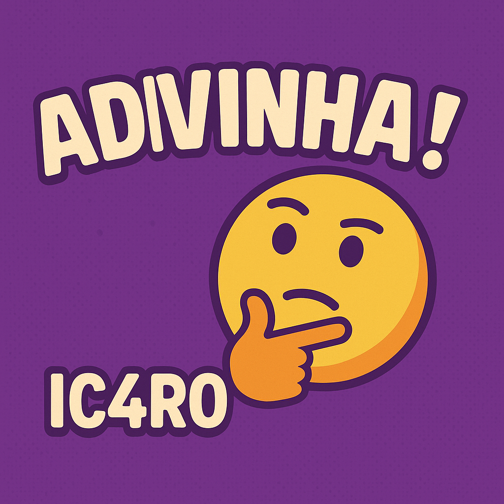

<p align="center">
    
</p>
# 🎯 ADIVINHA!

✨ *Um mini jogo de adivinhação em Python feito por* **IC4R0** ✨

---

## 🕹️ Sobre o Jogo

**ADIVINHA!** é um jogo simples e divertido onde o objetivo é adivinhar um número entre **1 e 10**. A cada tentativa, o jogo te diz se o palpite deve ser **maior** ou **menor**. Continue tentando até acertar!

Ah, e tem um toque especial com **ASCII Art** para deixar tudo mais estiloso! 😎

---

## 🚀 Funcionalidades

- 🔢 Gera um número aleatório entre 1 e 10
- 💬 Dicas interativas sobre o palpite
- 🥳 Mensagem de vitória estilizada
- 🎨 Banner divertido em ASCII art com `pyfiglet`

---

## 🛠️ Tecnologias Usadas

- 🐍 Python 3
- 🔤 pyfiglet (para o banner)

---

## 📦 Requisitos

- Python 3 instalado
- Biblioteca `pyfiglet`:

```bash
pip install pyfiglet
```

---

## ▶️ Como Jogar

1. Clone o repositório:

```bash
git clone https://github.com/IC4R0/ADIVINHA.git
cd ADIVINHA
```

2. Instale a dependência:

```bash
pip install pyfiglet
```

3. Rode o jogo:

```bash
python JOGO_ADIVINHA.py
```

4. Divirta-se adivinhando! 🎉

---

## 📁 Estrutura do Projeto

```
📂 ADIVINHA/
├── 🎨 ASCII_Art.py      # Banner em arte ASCII
├── 🎮 JOGO_ADIVINHA.py  # Lógica principal do jogo
└── 📄 README.md         # Este arquivo lindo aqui 😄
```

---

## 📝 Licença

Este projeto está sob a licença MIT. Confira o arquivo `LICENSE` para mais detalhes.

---

> Feito com por **IC4R0**

